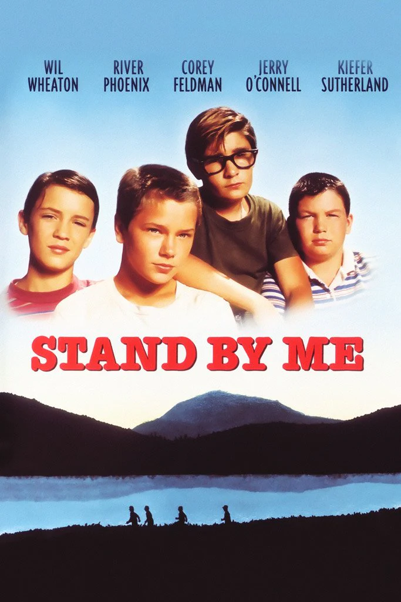

# Top 3 Best Movies of All Time
After having watched tons of movies throughout my life, I have come to gain some very strong opinions in the world of film; these are the top 3 best movies of all time, in my opinion. B)

## #3: Napoleon Dynamite
### Jared Hess, 2004

"In small-town Preston, Idaho, awkward teen Napoleon Dynamite (Jon Heder) has trouble fitting in. After his grandmother is injured in an accident, his life is made even worse when his strangely nostalgic uncle, Rico (Jon Gries), shows up to keep an eye on him. With no safe haven at home or at school, Napoleon befriends the new kid, Pedro (Efren Ramirez), a morose Hispanic boy who speaks little English. Together the two launch a campaign to run for class president."
#### _IMDb Page: https://www.imdb.com/title/tt0374900/_

## #2: Stand By Me
### Rob Reiner, 1986

"After learning that a stranger has been accidentally killed near their rural homes, four Oregon boys decide to go see the body. On the way, Gordie Lachance (Wil Wheaton), Vern Tessio (Jerry O'Connell), Chris Chambers (River Phoenix) and Teddy Duchamp (Corey Feldman) encounter a mean junk man and a marsh full of leeches, as they also learn more about one another and their very different home lives. Just a lark at first, the boys' adventure evolves into a defining event in their lives."
#### _IMDb Page: https://www.imdb.com/title/tt0092005/_

## #1: The Godfather
### Francis Ford Coppola, 1972

"Widely regarded as one of the greatest films of all time, this mob drama, based on Mario Puzo's novel of the same name, focuses on the powerful Italian-American crime family of Don Vito Corleone (Marlon Brando). When the don's youngest son, Michael (Al Pacino), reluctantly joins the Mafia, he becomes involved in the inevitable cycle of violence and betrayal. Although Michael tries to maintain a normal relationship with his wife, Kay (Diane Keaton), he is drawn deeper into the family business."
#### _IMDb Page: https://www.imdb.com/title/tt0068646/_

